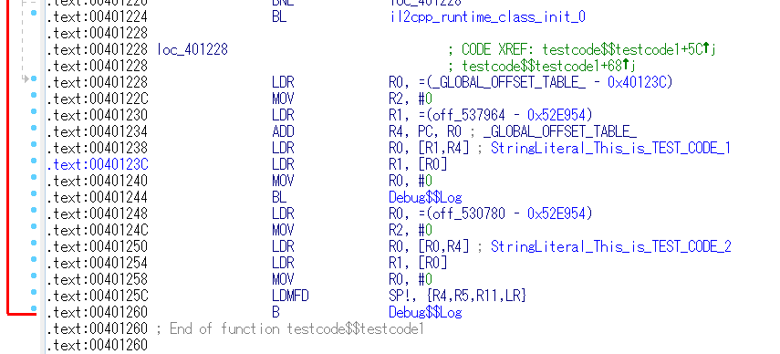

# unity_metadata_loader

This project will load strings and method/class names in global-metadata.dat to IDA.

detail: https://github.com/nevermoe/unity_metadata_loader

## how to build unity_decoder.exe

    $ git clone https://github.com/kenjiaiko/unity_metadata_loader/
    $ cd unity_metadata_loader/unity_decoder
    $ mv libil2cpp_v23 libil2cpp

Rename libil2cpp_vXX to libil2cpp. Open "unity_decoder.sln" using Visual Studio 2017.

## how to load strings and method/class from global-metadata.dat

sample apk: https://1drv.ms/u/s!ApYX-BnkUapSgn_fj9o7JsJGz7YU

    $ mkdir tmp
    $ cp test.apk\assets\bin\Data\Managed\Metadata\global-metadata.dat tmp\
    $ cp test.apk\lib\armeabi-v7a\libil2cpp.so tmp\
    $ cp unity_metadata_loader/Release/unity_decoder.exe tmp\
    $ cp unity_metadata_loader/unity_loader_v23.py tmp\
    $ cd tmp
    $ ./unity_decoder.exe

Copy global-metadata.dat, libil2cpp.so, unity_decoder.exe and unity_loader_vXX.py to the same folder(ex: tmp\), then execute unity_decoder.exe. The exe file will make 2 files which name are "method_name.txt" and "string_literal.txt". 

Load libil2cpp.so on IDA, select File -> Script file..., and "unity_loader_v23.py". By the way, this script not support x86.

    # Output window
    offset of method start: 0x521e38L
    offset of string finish: 0x5212e4L

The script output method base address and string base address.

    .data.rel.ro:00521E38 off_521E38  DCD Locale$$GetText     ; DATA XREF: .data.rel.ro:0052DDC0
    .data.rel.ro:00521E3C             DCD Locale$$GetText_0   ; Locale$$GetText
    .data.rel.ro:00521E40             DCD SafeHandleZeroOrMinusOneIsInvalid$$_ctor
    .data.rel.ro:00521E44             DCD SafeHandleZeroOrMinusOneIsInvalid$$get_IsInvalid
    .data.rel.ro:00521E48             DCD SafeWaitHandle$$_ctor
    .data.rel.ro:00521E4C             DCD SafeWaitHandle$$ReleaseHandle
    .data.rel.ro:00521E50             DCD CodePointIndexer$$_ctor
    .data.rel.ro:00521E54             DCD CodePointIndexer$$ToIndex

libil2cpp.so in test.apk, have 2 string "This_is_TEST_CODE_1" and "This_is_TEST_CODE_2".

    .data.rel.ro:0052126C             DCD StringLiteral___0_F1____1_F1__
    .data.rel.ro:00521270             DCD StringLiteral___0_F1____1_F1____2_F1__
    .data.rel.ro:00521274             DCD StringLiteral___s__w_______w____s_$
    .data.rel.ro:00521278             DCD StringLiteral_This_is_TEST_CODE_1
    .data.rel.ro:0052127C             DCD StringLiteral_This_is_TEST_CODE_2
    .data.rel.ro:00521280             DCD StringLiteral_JNI__Unknown_generic_array_type__

libil2cpp.so have testcode$$testcode1 class/method, code of testcode1 method is below.

## How to use this script on IDA Demo

IDA Demo doesn't support Python, so install Python2.7 from http://www.python.org/ and idapython from https://github.com/idapython/bin (ex: idapython-6.9.0-python2.7-win.zip).

1. unzip idapython-6.9.0-python2.7-win.zip
2. Copy the "python" directory to "C:\Program Files (x86)\IDA Demo 6.95\"
3. Copy the contents of the "plugins" directory to the "C:\Program Files (x86)\IDA Demo 6.95\plugins\"
4. Copy "python.cfg" to "C:\Program Files (x86)\IDA Demo 6.95\cfg\"

